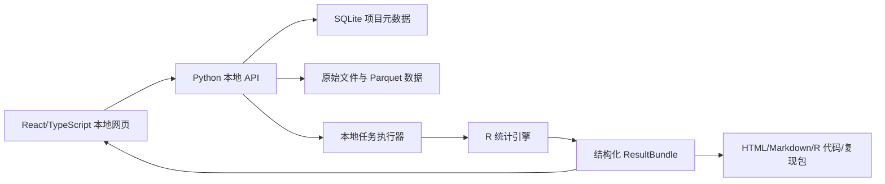

# 00 立项总览

> 文档版本：2.0（2026-07-18）
> 文档角色：产品章程与文档导航；不单独证明某项统计能力已经可执行或已经验证。

## 0. 文档权威层级

为避免早期路线图、实现记录与当前代码互相冲突，项目文档按以下顺序解释：

1. **机器事实**：`project.manifest.json`、JSON Schema、OpenAPI、capability registry、自动化测试和 `docs/debt-register.json`；
2. **当前规范**：本文件、`01`—`11`、`18`、`24` 和 `27`；其中 `27` 是 OB/CB 实验法与问卷法的目标能力和工作包权威来源；
3. **实时状态**：README 当前能力区、capability API、债务总账和 `28` 仓库收口审计；能力族 `executionAvailable=true` 只表示存在 runner，不代表该族所有子模型均完成；
4. **历史证据**：`12`—`17`、`20`、`21`、`23`、`26` 和 `docs/audits/` 只描述相应日期的阶段快照，不覆盖当前规范。

任何文档中的“完成”都必须指出完成的是工程接线、方法切片、验证还是正式支持。没有独立数值金标准、失败边界、结果契约和端到端证据的能力不得称为 `supported`。

## 1. 项目章程

- 项目代号：研径 ResearchPath
- 项目性质：个人、本地、非商业科研工具
- 目标平台：Windows 本地网页应用
- 主要用户：使用问卷数据开展管理学、社会科学等实证研究的个人研究者
- 立项日期：2026-07-13
- 当前阶段：核心问卷/PROCESS/SEM 工作流可用；高级分析平台已接线但各方法切片仍处于 `experimental`；进入 OB/CB 全流程研究工作台建设阶段

## 2. 产品愿景

将“数据文件—题项—构念—统计模型—结果—论文证据链”放在一个可视化工作台中，使研究者能够看见模型、理解每一步统计含义，并随时复现结果。

产品不是自动寻找显著模型的工具，也不是 PROCESS 的图形外壳。它是以理论模型为入口、以统计协议为约束、以完整审计记录为出口的低代码研究环境。

## 3. 当前成功定义

作为研究者主要实证工作台，成功必须同时满足以下条件：

1. 用户可以从研究设计、材料/量表、数据导入、质量治理、测量模型、假设检验到论文级导出完成可追溯闭环；当前已实现部分和目标缺口以 `27` 的能力矩阵为准。
2. 同一数据、模型、设置和种子重复运行得到一致结果。
3. 每个对外宣称支持的方法切片均通过独立数值金标准、边界、契约、恢复、性能与端到端验证。
4. 系统不会静默修改数据、静默选择估计方法或自动使用因果语言。
5. 验证性与探索性分析、计划与偏离、主分析与稳健性分析能够被明确区分并进入审计链。

## 4. 已确定的产品原则

### 4.1 本地优先

数据和计算均留在本机。应用默认不联网、无遥测、无账号系统。后续若增加外部 AI，仅允许显式选择并展示将发送的内容。

### 4.2 研究对象先于界面

画布只是 ModelSpec 的编辑器。每个节点、路径、控制变量和变换都必须有机器可读语义，不能只保存在坐标和连线中。

### 4.3 统计计算与说明生成分离

数值结果只允许由版本锁定的统计代码产生。规则引擎或 AI 可以解释已有结果，但不得计算或改写统计量。

### 4.4 默认保守、允许有据覆盖

遇到数据类型冲突、样本不足、严重缺失或模型不可识别时，系统优先阻止或强提醒。用户可以在部分警告上继续，但必须记录理由。

### 4.5 原始数据不可变

导入文件只读保存。反向计分、中心化、量表合成等均以转换流水线表达，不覆盖原列。

## 5. 范围与当前状态

| 能力域 | 当前状态 | 目标口径 |
|---|---|---|
| CSV/XLSX/SAV、字典、不可变数据版本 | 已实现 | 增强编码、缺失和质量治理 |
| 量表计分、α/ω、EFA/CFA、效度与问卷报告 | 已实现连续近似切片 | 补有序题项、交叉验证、ESEM、等值性和方法选择向导 |
| PROCESS 等价 Model 1/4/6/7/8/14/15 | 已实现 | 补设计先行、敏感性、多重性和论文级报告 |
| Logistic、SEM 与稳健组间比较 | 已实现部分切片 | 按 estimand 和数据条件扩展并逐项验证 |
| 实验、LMM、纵向、MI、功效 | 能力族 runner 可执行，子切片 `experimental` | 按 `18`/`25`/`27` 的阶段门逐切片升为 `supported` |
| 研究设计、预注册、材料、样本流、排除与偏离治理 | 不完整 | `27` P0/P1 工作包 |
| 论文级 Word/HTML/可复现包与结果证据图谱 | 不完整 | `27` 报告与复现工作包 |

当前代码、业务入口、协议、测试与文档之间的接线状态，以及已删除/保留代码的证据化决定，统一见 `28-代码-业务-文档一致性与仓库收口审计.md`。该文档描述交付时点，不替代 `27` 的未来方法需求。
| 云端协作、账号、计费 | 不在当前愿景 | 保持本地优先；外部 AI 仅显式、最小数据和可审计 |

## 6. 核心架构

## 7. 核心交付物

- 可执行的本地网页应用；
- 版本化项目目录；
- ModelSpec 和 ResultBundle 协议；
- R 统计计算模块；
- 金标准数值测试集；
- 可复现分析包；
- 面向论文写作的结构化报告。

## 8. 参考基线

- PROCESS 当前能力和限制以其[官方介绍](https://www.processmacro.org/index.html)与[官方 FAQ](https://www.processmacro.org/faq.html)为方法参照，而不是将第三方旧模板作为规范。
- 潜变量扩展以 [lavaan 官方教程](https://lavaan.ugent.be/tutorial/)为首选开源计算基线。
- 报告结构参考 [APA JARS](https://www.apa.org/education-career/training/reporting-research-jars.html)强调的透明、可评价和可复现原则。

## 9. 历史立项完成条件

以下内容是 2026-07-13 的立项出口，不是当前发布判定：

- 本目录全部文档进入 `baseline-1` 状态；
- ModelSpec 示例通过 JSON Schema 校验；
- MVP 的 P0 范围不再添加新模型；
- 开发工作按路线图进入第一个垂直切片。
