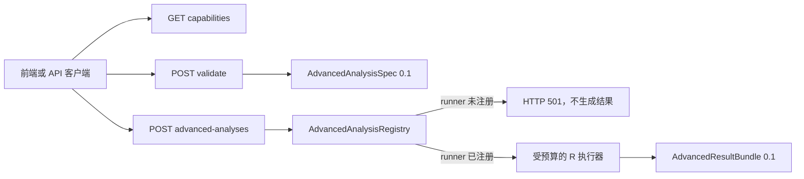

# 18 高级统计方法开发指南与接口规范

> 文档版本：0.2.1
> 日期：2026-07-20
> 范围：多因素/重复测量实验、多层模型、纵向模型、多重插补、功效分析，以及与 R2 测量中心交界的能力状态
> 当前状态：六个高级 family 均已接入后台任务；R2 问卷测量、R3 有限 cluster GLM、R4 线性 Rubin/有限 Monte Carlo、R5 aggregation/纵向实验 slice 已有真实 R 分发和专项 smoke。具体 slice 的独立金标准、UI/导出、跨软件复核和发布门禁仍不完整，统一保持 `experimental`。

## 1. 目的与发布原则

本规范用于后续逐项开发六类高级 family，同时保护现有 PROCESS、问卷实证和 SEM 工作流不受破坏。新增方法不得仅以“R 包能够运行”作为完成标准，必须同时满足：

1. 估计目标（estimand）和适用设计明确；
2. 输入规格、数据结构、缺失处理和编码方式可复现；
3. 计算结果经过独立软件或公开金标准验证；
4. 失败边界不会静默换模型、换估计器或删除数据；
5. 结果接口包含样本流、诊断、警告和 provenance；
6. 前端只展示能力目录中 `executionAvailable=true` 的功能。

禁止用空表、固定示例数字或普通 OLS 结果冒充尚未实现的高级模型。已注册 family 生成带数据版本、规格哈希、包版本、随机种子和引擎输出校验的 `AdvancedResultBundle`；未注册 family 才返回 HTTP 501。

## 2. 协议和扩展架构

高级方法不扩展现有 `ModelSpec.estimation.family`，而使用独立协议：

- `AdvancedAnalysisSpec 0.1.0`：输入设计、变量映射、估计器和随机设置；
- `AdvancedResultBundle 0.1.0`：成功结果的通用封装及家族专属结果；
- `AdvancedAnalysisRegistry`：能力声明和 runner 注册点；
- 能力目录：前端和外部客户端查询功能是否真正可执行。



### 2.1 当前接口

| 方法与路径 | 用途 | 当前行为 |
|---|---|---|
| `GET /api/v1/advanced-analyses/capabilities` | 查询六类能力、协议版本、预定引擎和最低验证要求 | 可用 |
| `POST /api/v1/advanced-analyses/validate` | Pydantic 判别联合类型和跨字段语义校验 | 可用；返回 `executionAvailable` |
| `POST /api/v1/advanced-analyses` | 统一运行入口 | 已注册的六类 experimental runner 生成经 schema 校验的结果；未注册 family 返回结构化 501 |
| `/api/openapi.json` | 前端/外部客户端生成类型的权威来源 | 可用 |

机器可读协议：

- `specs/advanced-analysis-spec.schema.json`
- `specs/advanced-result-bundle.schema.json`

Python 类型定义在 `apps/api/app/advanced_contracts.py`，前端聚焦类型位于 `apps/web/src/types/advanced.ts`；`apps/web/src/types.ts` 仅为兼容 barrel。Python/Pydantic 是运行时校验权威；JSON Schema 是跨语言契约。两者有差异时必须先修复契约漂移，不得直接放宽运行时校验。

### 2.2 能力生命周期

| 状态 | 含义 | 是否可出现在正式 UI | 是否可生成正式结果 |
|---|---|---:|---:|
| `planned` | 只有协议、指南和测试占位 | 否 | 否 |
| `experimental` | 存在真实 runner 或有限切片，但支持范围、金标准、UI/导出或真实研究试用尚未完成 | 仅开发者开关 | 只可生成带实验性警告的开发结果，不得当作正式方法结论 |
| `supported` | 全部门禁和发布审查通过 | 是 | 是 |

`executionAvailable` 由注册表是否存在 runner 动态决定，不能根据状态字符串推断。runner 开发完成后调用：

```python
advanced_analysis_registry.register_runner("experimental_design", run_experiment)
```

当前 runner 受 180 秒统一预算、不可变数据集路径和输出 schema 约束；多重插补当前 R runner 实际写出按编号隔离的 CSV 派生文件，父版本、列 schema、SHA-256 和 Parquet 产物契约仍未闭合。六个核心 runner 已接入持久化后台任务、SSE 进度、取消、超时和中断对账；高级结果已接入带身份/规格哈希校验的含数据与不含数据复现导出，方法专属表映射已存在，但正式论文视觉 QA 和研究试用仍不完整。registry 中的 `questionnaire_measurement` 已有 `run_advanced_analysis.R` 的实际 family 分发，但其各模型仍是有限 experimental slice。

### 2.3 当前 slice 真实性矩阵

| Family | 当前可运行基础 | 当前不得宣称完成的关键项 |
|---|---|---|
| `experimental_design` | 组间/ANCOVA/单组内因子切片可执行；单一组间因子已接入真实 Games–Howell；单一组间因子的预注册计划对比已接入 emmeans；三套公开数据 golden、GG/EMM/CI、结构化 EMM 图及空/缺失/秩亏边界已验证 | Games–Howell 的更多独立金标准、计划对比的更多独立金标准、效应量 CI、多组内因子与第二专有软件对照 |
| `multilevel_model` | Gaussian 两层 LMM；显式固定效应、group/grand centering、Satterthwaite/Kenward–Roger、df/CI provenance、公开数据 golden 与数值失败边界 | 非 Gaussian、三层、GLMM、CR2、两层中介及 Stata 第二软件对照 |
| `longitudinal_model` | 观测增长明确区分 complete cases 与 `available_rows_ml`；传统 CLPM 的 ML FIML 已覆盖单调/非单调 attrition、re-entry；显式 group 的纵向 invariance、RI-CLPM、latent growth 已有实验 runner/smoke | 恢复模拟、Heywood/非正定矩阵、跨软件对照、完整 UI/导出和正式发布门禁 |
| `multiple_imputation` | 生成多个不可变插补数据集；冻结线性回归下游按 Rubin/Barnard–Rubin 合并 | GLM/D1-D3、多层/纵向下游、完整诊断和被动规则安全 DSL |
| `power_analysis` | 回归/t 检验/组间 ANOVA 解析分支；三种解析反解和有限 Gaussian 回归/均衡 ANOVA Monte Carlo 已返回有效分母、MCSE、Wilson 区间 | planned contrast、precision/TOST、中介/多层/SEM Monte Carlo、跨软件/真实研究和正式发布闭环 |
| `questionnaire_measurement` | R2 的连续/有序 EFA/CFA/WLSMV/invariance/ESEM/Bifactor/IRT/CMB 已由 `run_advanced_analysis.R` 分发，psych/GPArotation 已锁定；统一 Advanced Spec/ResultBundle 已接入 | 各模型独立金标准、专用 UI/导出、失败矩阵和正式支持门禁 |

该表是 2026-07-20 代码审计基线。任何条目变更必须同时更新契约、测试、capability slice、`25`、`27` 和债务总账，不能只修改状态文字。

## 3. 通用科研与工程规范

### 3.1 规格、哈希和版本

- `schemaVersion` 使用语义版本；删除字段、改变默认估计量或改变统计含义必须升主版本。
- 统计哈希排除 UI 布局，但必须包含变量映射、对比编码、缺失处理、seed、估计器、自由度方法和校正方式。
- 所有数组在计算哈希前按稳定 ID 排序；有时间顺序含义的 `waves` 和水平列表不得排序。
- 数据集必须使用不可变 DatasetVersion；多重插补产生新的派生数据版本，禁止覆盖原始数据。

### 3.2 最小结果要求

每个成功结果必须包含：

- `run`：运行 ID、分析 ID、family、specHash、耗时；
- `sampleFlow`：原始、纳入、排除 N，以及 cluster/wave/imputation 数；
- `estimates`：未格式化原值、SE、统计量、df、p 和 CI；
- `diagnostics`：模型级和数据级诊断；
- `warnings`：不可忽略的方法限制；
- `provenance`：引擎、包版本、数据哈希、seed、estimand、df/合并口径；
- `familyResult`：该方法专属表格和图形数据。

取消、不收敛、不可识别或估计器失败不得生成 `status=succeeded` 的 bundle。

`provenance` 至少应保留 `family`、`specHash`、引擎/包版本、数据 SHA、seed、缺失处理、估计器和 estimand；MLM 还必须记录 cluster、中心化、df 方法，纵向还必须记录 modelType、waveLabels、timeValues 和样本处理。导出器只能读取已校验的 bundle，不得在表格或 Markdown 报告中重新计算统计量。

### 3.3 缺失、异常与可复现

- 不允许未记录的 listwise deletion；所有排除必须进入 sampleFlow。
- 随机方法必须在 R/Python 两端显式设置并回传 seed。
- 不允许在数值失败时自动从 GLMM 改成 LM、从 REML 改成 ML、从 FIML 改成完整案例或从 MI 改成均值填补。
- 自动简化随机效应、协方差结构或等值性约束必须先取得用户确认，并生成新的规格哈希。
- 浮点显示与底层数值分离；导出和界面不得重新计算统计量。

### 3.4 每项能力的发布门禁

至少包括：

1. 单元测试：公式、编码、df、CI、合并规则；
2. 金标准测试：至少 3 个公开/固定数据集，与两个独立来源之一对照；
3. 边界测试：小样本、奇异、分离、非正定、不收敛、缺组/缺波；
4. 契约测试：合法输入、非法输入、版本不匹配和结果 schema；
5. 性能测试：默认规模和最大允许规模；
6. 视觉 QA：表格、图形、脚注和警告；
7. 复现测试：相同数据/规格/seed 逐字段一致。

数值容差必须按指标定义，不得统一拍脑袋设为 `1e-5`：解析闭式解可用 `1e-8`；迭代估计可按估计量和参考软件收敛容差设定；Monte Carlo 结果应按模拟标准误判断，而不是要求逐次相等。

## 4. 多因素、ANCOVA 与重复测量实验

### 4.1 支持顺序

1. 两因素/多因素组间 ANOVA；
2. ANCOVA 与估计边际均值；
3. 单因素重复测量；
4. 组内×组间混合设计；
5. 非球形、缺失与小样本下的混合模型替代路径。

### 4.2 规格和 estimand

`family=experimental_design`。核心字段包括 `designType`、`betweenFactors`、`withinFactors`、`subjectId`、`covariateIds`、`sumOfSquares`、球形性校正和事后校正。

必须预先声明：

- 主效应是否在交互存在时仍作为目标 estimand；
- 因子编码和参考水平；
- Type II/III 平方和；
- ANCOVA 的调整均值范围和协变量中心化值；
- 计划对比与探索性事后比较的区别；
- 宽格式到长格式的确定性映射。

### 4.3 计算规范

以下是正式切片必须达到的规范；当前 runner 尚未全部满足：

- 默认 Type III + sum coding，若采用 treatment coding 必须显示参考组。
- 重复测量报告 Mauchly 球形性、Greenhouse–Geisser ε、Huynh–Feldt ε；不满足球形性时主表以校正 df/p 为准。
- 方差不齐的纯组间设计提供 Welch/Brown–Forsythe 和 Games–Howell；不要把它们机械套用于组内设计。
- ANCOVA 检查协变量与处理交互（斜率同质性），不能只报告一个 Levene 检验。
- 效应量至少报告 partial η²，并可选 generalized η²；必须写明定义和 CI 方法。
- 估计边际均值与 contrast 直接由模型矩阵计算，不从分组原均值手工相减。

### 4.4 结果和诊断

`familyResult` 至少包含 omnibus tests、estimated marginal means、contrasts 和 sphericity。诊断必须覆盖单元格 N、空单元格、秩亏、方差齐性、异常残差、球形性和不可估交互。

### 4.5 金标准与验收

- R `afex::aov_car`/`emmeans` 与 SPSS GLM 或 SAS PROC MIXED 对照；
- 覆盖平衡/不平衡、缺单元格、球形/非球形、宽/长格式；
- 固定编码下 F、df、p、EMM 和 contrast 与参考结果一致；
- 图形只使用 EMM/CI，不把原始均值冒充调整均值。

当前实现审计：已删除伪 Games–Howell、缺失效应量写 0 和原始均值图；单一组间因子且无协变量的请求使用真实 studentized-range Games–Howell，其他不适用设计稳定拒绝。正式图由结构化 EMM/CI 在前端生成，不注入 R SVG；O'Brien–Kaiser、ToothGrowth、Moore 三套公开数据及空单元、缺波、重复单元、秩亏边界已自动验证。第二专有软件对照和更多设计切片完成前仍保持 `experimental`。

## 5. 多层与广义多层模型

### 5.1 支持顺序

1. 两层随机截距 LMM；
2. 随机斜率、跨层交互和中心化；
3. 三层模型；
4. 二项/Poisson GLMM；
5. 两层中介和 Monte Carlo/贝叶斯区间。

### 5.2 规格和 estimand

`family=multilevel_model`。规格必须区分 fixed effects、random effects、聚类层级和中心化规则。组均值中心化后，如需区分组内/组间效应，必须同时加入组均值变量；不得把组均值中心化系数解释为总体效应。

### 5.3 计算规范

以下是目标规范。当前 Pydantic 只允许 Gaussian outcome，R 中不可达的 `glmer` 分支已删除；非 Gaussian 请求由协议稳定拒绝。当前组均值中心化仍会自动加入组均值项，必须改为由规格显式声明；固定效应 CI/df 必须与 Satterthwaite/Kenward–Roger/asymptotic 的实际推断口径一致。

- 高斯模型默认 REML 报告最终方差成分；嵌套固定效应模型比较统一使用 ML 后再回拟 REML。
- 固定效应 df 明确选择 Satterthwaite、Kenward–Roger 或 asymptotic，不能只写“t 检验”。
- 报告无条件 ICC、条件 ICC、marginal/conditional R²、方差成分和随机效应相关。
- 二分类/计数结果明确 link 和尺度；OR 与概率预测分开。
- 小聚类数提供 CR2/有限样本提示；默认少于 30 个 cluster 触发高优先级警告，而不是机械阻断。
- singular fit、梯度不收敛、边界方差和高随机效应相关必须进入诊断。

### 5.4 金标准与验收

- `lme4::sleepstudy` 与 `lmerTest`/Stata mixed 对照；
- 覆盖随机截距、随机斜率、三层、GLMM、奇异拟合和不平衡 cluster；
- 固定效应、方差成分、logLik、ICC 和 df 方法逐项核对；
- 中心化必须有人工可解的小矩阵测试。

## 6. 纵向、面板与增长模型

### 6.1 支持顺序

1. 观测变量增长曲线（时间嵌套于个体）；
2. 纵向测量等值性；
3. 传统 CLPM；
4. RI-CLPM；
5. 潜在增长曲线与平行过程模型。

### 6.2 数据和规格

`family=longitudinal_model`。`waves` 使用稳定构念键映射各波变量，并显式存储 `timeValue`，以支持不等距时间。RI-CLPM、增长模型和潜在增长至少需要 3 波；两波数据不得被界面误导为可分离稳定个体差异。

### 6.3 计算规范

以下是目标规范。当前 runner 的观测增长固定加入随机斜率，并在多 stable key 时明确警告仅使用首个 key；观测增长的 `fiml` 由契约稳定拒绝，`complete_cases` 与 `available_rows_ml` 口径分开。RI-CLPM、latent growth 和 longitudinal invariance 已有显式分支，RI-CLPM/纵向不变性会返回模型样本量与缺失模式；这些切片仍不能替代独立金标准、跨软件复核和正式发布门禁。

- 在比较结构路径前先完成纵向 configural/metric/scalar 等值性；有序题项使用 thresholds 口径。
- CLPM 与 RI-CLPM 的解释必须分开：前者混合个体间与个体内信息，后者才用于个体内偏离的滞后关系。
- 报告自回归、交叉滞后、同期协方差、随机截距方差及波次残差。
- FIML 保留部分观测个体；WLSMV 不伪装支持 FIML。
- 时间不等距时，线性斜率载荷使用实际 `timeValue`，不得默认 0/1/2。
- attrition、每波 N、完整波数组合和失访选择性必须进入 sampleFlow/diagnostics。

### 6.4 金标准与验收

- lavaan 官方增长/面板示例、公开三波数据与 Mplus 输出对照；
- 覆盖不等距、部分缺失、等值性失败、Heywood、非正定和只有两波的阻断；
- 对固定 seed 的模拟参数恢复率、偏差、覆盖率做 Monte Carlo 验证。

## 7. 多重插补

### 7.1 产品定位

多重插补不是一个“填补空格”的按钮，而是产生多个不可变派生数据版本并在后续分析中按 Rubin 或模型比较规则合并。原始数据始终只读。

### 7.2 规格和方法映射

`family=multiple_imputation`。每个变量显式声明方法和 predictor matrix；默认自动映射建议为：连续近似正态用 normal 或更稳健的 PMM，二分类用 logistic，名义多分类用 multinomial logistic，有序变量用 ordinal logistic。自动建议必须允许人工覆盖。

被动变量（总分、交互、变换）通过 `passiveRules` 在每轮插补内重算，禁止先插补派生变量再破坏代数约束。嵌套数据必须使用两层插补方法或明确说明忽略聚类的影响。

### 7.3 计算与合并规范

当前 runner 支持两种明确状态：`pooling=none` 只生成不可变插补数据集并返回 `poolingStatus=not_available`；`pooling=rubin` 必须同时提供冻结的 `pooledAnalysis`，当前正式接线的下游模型为线性回归，逐份拟合后返回非空 pooled estimates、Qbar/Ubar/B/T、FMI 和 Barnard–Rubin df。未声明 pooled 模型不得悄悄选取第一份插补数据。

- 默认 `m>=20`；高缺失信息比例时建议 m 不小于 FMI 百分比量级，并展示 Monte Carlo error。
- burn-in/iterations 与链数必须记录；每个链使用从主 seed 确定性派生的子 seed。
- 系数与方差使用 Rubin 规则；多参数检验使用 D1/D2/D3 中明确选择的方法。
- 标准化系数、R²、间接效应和拟合指标不能盲目按普通标量 Rubin 规则合并，需为每个 estimand 单独定义。
- 不插补结构性缺失、ID、确定不适用值或结局发生后的变量。
- 插补模型应包含分析模型中的结果、预测、辅助变量、交互构成项和聚类/时间结构。

### 7.4 诊断和验收

- trace、观测/插补分布、overimputation、FMI、relative efficiency；
- 记录每变量方法、预测变量和失败次数；
- MCAR/MAR 合成数据检验参数偏差和 CI 覆盖率；
- 与 `mice`/`mitml` 官方示例和 Stata `mi estimate` 对照 Rubin 合并；
- MNAR 不得宣称由 MI 自动解决，应预留 delta adjustment/pattern-mixture 敏感性分析。

## 8. 功效分析

### 8.1 模式

`family=power_analysis`，支持反解 sample size、power 或 effect size。当前解析执行覆盖双侧 t 检验、普通回归和组间 ANOVA；中介、调节、SEM、多层和复杂重复测量需使用未来的 Monte Carlo 切片。

### 8.2 规范

以下规范同时约束解析和未来 Monte Carlo。当前 `PowerAnalysisSpec` 只允许双侧 t 检验、回归和组间 ANOVA 进入解析执行；中介/多层 Monte Carlo 由协议稳定拒绝；2026-07-18 已删除相应不可达 R 分支。未来必须先完成契约、DGP、失败口径和任务预算设计，再新增可达执行代码，不能以预埋分支作为完成证据。

- 输入的是最小有意义效应（SESOI）或有依据的参数，不接受直接把先导研究显著效应当真值而不提示 winner's curse。
- 报告 α、目标 power、检验单双侧、预测变量数、组数、失访/设计效应膨胀和最终向上取整规则。
- 多层模型同时变化 cluster 数和平均 cluster size，优先展示等功效组合，不只返回一个总 N。
- 重复测量包含相关结构、测量次数、球形性/ε 和失访模式。
- Monte Carlo 报告 simulations、seed、收敛率和功效估计的 Monte Carlo SE；若 `MCSE > 0.005` 默认提示增加模拟次数。
- SEM 功效同时评估目标参数显著性、模型收敛、Heywood 率和可选的整体拟合检验。

### 8.3 金标准与验收

- 简单 t/ANOVA/回归与 G*Power、R `pwr`/`WebPower` 对照；
- 解析可解场景与 Monte Carlo 结果应在其 MCSE 范围内一致；
- 固定 seed 逐次复现，改变 seed 的差异应符合 MCSE；
- 反解 N 后回代验证实际功效达到目标，所有 N 向上取整。

2026-07-18 解析 slice 交付证据：`apps/api/tests/fixtures/advanced/` 已包含回归 3/8 个预测变量、N=100 功效、N=100 `R² change` 敏感性反解，以及 ANOVA 2/3/4 组和 N=159 功效的输入/golden。结果 provenance 记录 `R pwr` 版本、命令、比较字段和容差；敏感性反解在 R 内部使用高精度根求解，并通过实际功效回代。`effectSizeMetric` 是敏感性反解的目标尺度，不能用一个带占位数值的 `effectSize` 猜测。2026-07-22 又为双侧两独立样本 t 检验补齐四类 Case、SciPy 与独立 mpmath 积分双参考、稳定 one-sided 拒绝、多源消解及 23/23 能力级突变，Golden 状态达到 `autoverified_l3`。ANOVA 非整除总 N、未实现 allocation ratio 和复杂 Monte Carlo 仍有稳定拒绝边界。上述是工程和数值验证证据，不改变 family 及 slice 的 `experimental` 状态；G*Power/独立方法专家、真实 OB/CB 试用、容器化离线复现和正式 Release 仍是后续门禁。

## 9. 实施顺序与完成定义

建议按依赖关系实施：

1. **功效分析的解析基础**：风险较低，可先验证注册、结果协议和图表导出链路；
2. **组间多因素 ANOVA/ANCOVA**：复用现有组间比较和导出；
3. **重复测量/混合设计**：建立长宽转换、被试索引和 EMM/contrast 层；
4. **两层 LMM**：先闭合 Gaussian cluster 数据语义、中心化和随机效应结果；GLMM 作为后续独立切片；
5. **多重插补**：建立派生数据版本集合和 pooled-analysis 编排；
6. **纵向模型**：复用多层时间结构、SEM、FIML 和等值性；
7. **复杂方法的 Monte Carlo 功效**：直接调用已经验证的真实 runner。

单个 family 从 `planned` 升为 `experimental` 的最低完成定义：

- runner 接入后台任务、取消、进度和复现包；
- 输入/输出 schema 与前后端类型同步；
- 至少一个明确 slice 的真实数据、契约和基础数值测试通过；未通过的 slice 由稳定错误码拒绝并在 capability 中可查询；
- 能力目录动态返回 `executionAvailable=true`；
- 前端入口有“实验性”标记和方法限制；
- 审查报告记录引擎包版本、数值容差和未覆盖边界。

升为 `supported` 必须以 slice 为单位满足本文全部最低金标准、边界、契约、任务、复现、真实 CB/OB 数据集试用、独立方法专家复核、导出视觉 QA、性能上限和迁移兼容性验证。不能先把整个 family 一次性升为 `supported` 再补子模型证据。

## 10. 安全扩展清单

实现新 family 或子模型时按下列顺序提交：

1. 更新 `advanced_contracts.py` 与 JSON Schema；
2. 更新 TypeScript 判别联合类型；
3. 增加 capability/validate 的契约测试；
4. 编写纯编译器：Spec → engine input，先不执行；
5. 增加金标准和边界数据；
6. 实现 runner 与 ResultBundle schema 校验；
7. 接入后台任务、取消、日志、哈希和复现包；
8. 注册 runner 后 family 入口才会变为可执行；同时登记 slice 支持/拒绝矩阵；
9. 最后增加 UI；UI 不承担统计计算。

任何统计默认值变化都必须同时更新：开发指南、OpenAPI/Schema、前端帮助文本、provenance、金标准测试和发布说明。
