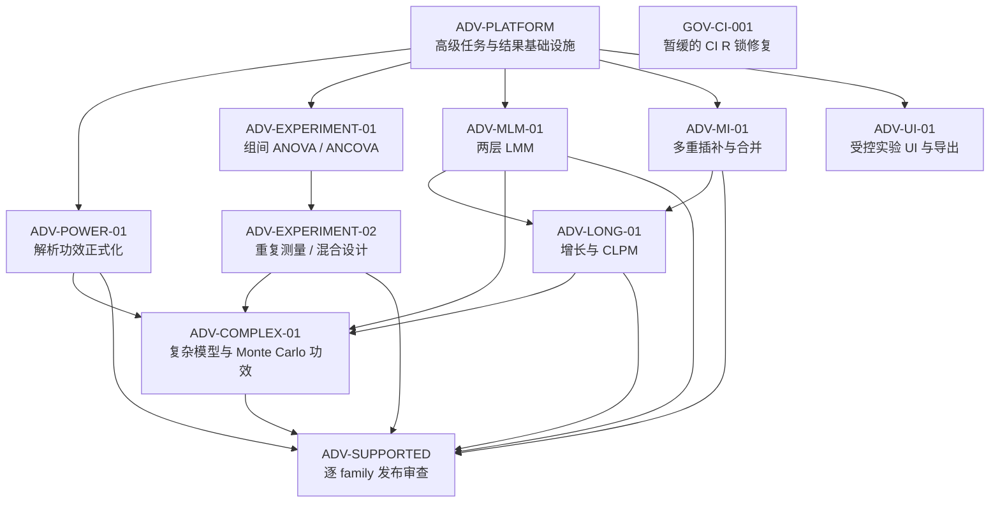

# 25 后续开发可执行手册

> 文档版本：1.1.0
> 建立日期：2026-07-17
> 复审日期：2026-07-18
> 适用对象：接手 ResearchPath 的开发者或通用 AI 代理
> 机器可读状态源：[`debt-register.json`](debt-register.json)
> 方法规格源：[`18-高级统计方法开发指南与接口规范.md`](18-高级统计方法开发指南与接口规范.md)
> OB/CB 产品需求源：[`27-OB-CB实验与问卷实证研究全流程能力审计及开发蓝图.md`](27-OB-CB实验与问卷实证研究全流程能力审计及开发蓝图.md)

本手册把当前代码中“已经能运行”和“可以作为正式科研能力发布”之间的差距拆成有顺序、可验证的工作包。任何代理应按本文的前置条件、禁止项、文件清单和验收命令实施；不得把本手册中的计划当作已完成能力。

## 1. 当前基线与范围

### 1.1 已完成、正在进行与外部阻塞

| 项目 | 真实状态 | 对后续开发的含义 |
| --- | --- | --- |
| 横截面单层问卷、PROCESS 等价模型、问卷实证、CFA/SEM | 已有正式工作流 | 不得为了开发高级方法改写或降级这些既有路径。 |
| 数据版本、项目 SQLite、备份恢复、路径边界、资源预算 | 已有实现和回归测试 | 新功能必须复用既有仓储与路径守卫，不能自行拼接状态目录。 |
| 高级分析异步后台任务 (ADV-PLATFORM) | **工程接线已完成**：SQLite 状态、SSE、取消、超时和中断对账 | 保留回归；它不证明任何统计 slice 的数值正确性。 |
| 六个高级 family | runner 已打通；解析/有限 Monte Carlo 功效、有限实验、两层 Gaussian LMM、aggregation、纵向、MICE/Rubin 和问卷高级测量切片可达，其余均存在下表记录的 slice 缺口 | 全部保持 `experimental`；**不得**在正式 UI 宣传为完整或 `supported`。 |
| `questionnaire_measurement` | 已有连续/有序 EFA/CFA/WLSMV/invariance/ESEM/CMB 的专用分发、结果契约和 R 依赖锁定 | 仍不能把 `executionAvailable=true` 解释为正式方法发布；必须继续补金标准、失败矩阵、UI/导出和 E2E。 |
| `METHOD-001` | `implemented_pending_verification` | 只有每个 family 分别满足本文第 9 节后，才能修改状态或能力标签。 |
| GitHub 受保护 CI | 外部阻塞 | 私有仓库的 required check 规则受 GitHub 套餐限制；此项不应阻塞方法代码开发。 |
| R 锁校验的远端误报 | 2026-07-17 历史暂缓项 | 见 GOV-CI-001；实时状态以总账和远端 CI 结果为准，不由本手册永久冻结。 |

“已完成”在本手册中只允许附带对象：工程平台、某个明确 slice、验证层级或发布门禁。R2–R5 的近期提交只证明新增代码/模块，不自动证明阶段完成；具体状态以 `docs/27` 第 19 节和 `docs/18` 第 2.3 节为准。以下工作包标题已按 2026-07-18 代码复审纠偏；正文中的“目标/必须”是待实现需求，不是完成证据。

### 1.2 绝对禁止项

1. 不重新启动 Codex Security 多轮扫描，也不生成新的安全扫描分片。现有安全回归测试和审计归档足以作为本轮工程背景。
2. 不因 R 包报错、收敛失败、缺失数据或数据布局不满足要求而静默改用 OLS、完整案例、均值填补、另一估计器或另一模型。
3. 不把一个返回了 JSON 的 runner 标记为 `supported`；必须完成跨软件金标准、后台任务、取消、导出、UI 和真实试用门禁。
4. 不手工编辑 `apps/web/src/types/generated-api.ts` 或 `specs/openapi.json`；契约改动后必须运行生成脚本。
5. 不写入仓库根目录、`docs/` 或已跟踪的 `output/performance/` 以外的运行数据。临时数据只能位于测试临时目录或被忽略的 `.researchpath/`、`output/`。
6. 不删除、迁移或清理 `.researchpath/workspace` 中的用户数据来让测试通过。测试必须使用 `apps/api/tests/conftest.py` 配置的临时状态根目录。

### 1.3 必读文件和真实入口

在改动前依次阅读以下文件，而不是仅依赖本手册摘要：

| 目的 | 必读文件 |
| --- | --- |
| 方法口径、支持顺序、完成定义 | `docs/02-科研方法规范.md`、`docs/06-统计验证与测试.md`、`docs/18-高级统计方法开发指南与接口规范.md` |
| 工程边界和门禁 | `AGENTS.md`、`docs/24-工程Harness与开发准则.md`、`project.manifest.json` |
| 实时债务状态 | `docs/debt-register.json`；`docs/23-收口复审与剩余工作清单.md` 仅为日期快照 |
| 高级协议和 API | `specs/advanced-analysis-spec.schema.json`、`specs/advanced-result-bundle.schema.json`、`apps/api/app/advanced_contracts.py`、`apps/api/app/api/routes/advanced.py` |
| runner 和数据访问 | `apps/api/app/services/advanced_analysis.py`、`apps/api/app/services/advanced_runner.py`、`engine/R/run_advanced_analysis.R` |
| 既有长任务模式 | `apps/api/app/services/analysis_jobs.py`、`apps/api/app/api/routes/analyses.py`、`apps/web/src/api/analyses.ts`、`apps/web/src/components/ModelBuilder.tsx` |
| 现有高级回归 | `apps/api/tests/test_advanced_analysis_contracts.py` |

## 2. 固定开发回路

每个工作包只做一个可独立验收的纵向切片，严格使用下列顺序：

1. 在 `docs/debt-register.json` 查明相关条目与验收条件；如果发现新风险，先登记条目，不能用隐式 TODO 代替。
2. 用 JSON Schema、Pydantic、OpenAPI 与 TypeScript 先定义或收窄协议；协议字段必须说明统计含义、单位、默认值和失败边界。
3. 写纯编译器或纯计算单元测试，再写 R runner；UI 不承担统计计算。
4. 建立固定的小型手工可核对数据、至少三个公开/固定金标准数据集和错误边界 fixture。私有软件输出只能放入未跟踪的 `validation-reference/`，不能提交。
5. 先运行相关 Python/R 测试，再运行 `scripts/harness.ps1 -Mode Quick`。
6. 合并前运行 `scripts/check-architecture.ps1` 与 `scripts/harness.ps1 -Mode Full`；候选发布运行 `-Mode Release`。不得降低覆盖率、性能、数值或 bundle 基线。
7. 更新本手册、`docs/18-高级统计方法开发指南与接口规范.md`、README 支持边界、`docs/debt-register.json` 和发布证据；只在所有条件可复现时变更状态。

PowerShell 7 命令：

```powershell
./scripts/check-architecture.ps1
./scripts/harness.ps1 -Mode Quick
./scripts/harness.ps1 -Mode Full
./scripts/harness.ps1 -Mode Release
```

## 3. 工作包依赖图



`GOV-CI-001` 与方法图平行，必须在用户重新允许时单独处理；不得把它混入任一统计工作包。

## 4. 共同的高级分析平台工作包

### [工程接线已完成] ADV-PLATFORM：高级 runner 持久化后台任务

**原始目标（工程部分已实现）**：把当时同步的 `POST /api/v1/advanced-analyses` 改为与模型/实证分析一致的后台任务。请求返回 `202 Accepted` 与可恢复任务状态；结果、取消、SSE 进度和方法专属复现包均使用稳定的 run ID。

**当前事实**：

- 高级分析已经使用聚焦的任务管理与 SQLite 状态，提交、状态、SSE、取消、结果和错误形成持久化流程。
- R 进程具备超时、进程树终止和服务重启后的中断对账；失败/取消不会生成成功 ResultBundle。
- 前端已有 `components/advanced/` 能力列表、向导、进度和结果入口。
- slice capability、结果字段映射和高级复现 ZIP 已接线；剩余工作是各 family 的独立数值/视觉验收、正式论文报告质量和真实研究试用，不得反向写成正式 `supported`。

**前置条件**：先确认 `AnalysisJobManager`、`AnalysisRepository` 与数据库迁移的字段约束；不要猜测 SQLite 表可直接承载高级规格。

**已实施区域与后续保持的不变量**：

| 层 | 文件/目录 | 必须完成的内容 |
| --- | --- | --- |
| 契约 | `apps/api/app/advanced_contracts.py`、两个 `specs/advanced-*.schema.json` | 增加稳定的高级任务状态/结果引用模型；运行中的状态不得冒充 `AdvancedResultBundle`。 |
| 数据库 | `apps/api/app/services/database_migrations.py`、`dataset_repository.py`、`analysis_repository.py` | 通过迁移新增或扩展高级 run 记录；保存 `analysisId`、family、spec JSON、spec hash、数据版本 ID、状态路径、结果路径、错误和时间戳。旧项目迁移必须幂等。 |
| 服务 | `analysis_jobs.py`、新建聚焦的 `advanced_jobs.py`（推荐）或明确扩展 `AnalysisJobManager` | 提供 `start_advanced`、`_run_advanced`、取消、进度、恢复失败标记和资源清理；不得让路由直接执行 R。 |
| R 进程 | `advanced_runner.py`、`engine/R/run_advanced_analysis.R` | 使用每个 run 的受控工作目录；支持取消标记和阶段进度文件/JSONL，进程终止后删除工作目录；最终结果在 Python 端做 schema 校验。 |
| 路由 | `api/routes/advanced.py` | `POST` 返回 202 高级任务状态；增加 `GET /advanced-analyses/{run_id}`、`DELETE`、`GET /progress`、`GET /result`、`GET /export`。路径语义要与已有 `/analyses/{run_id}` 一致但避免路由冲突。 |
| 前端 | `apps/web/src/api/advanced.ts`、`apps/web/src/types/advanced.ts`、新增 `components/advanced/` | 定义任务 API、SSE 订阅、刷新恢复、取消状态和错误展示；不要把 `unknown` 结果直接渲染。 |

**状态机**：只允许 `queued → running → succeeded | failed | cancelled`，取消请求可使用中间 `cancelling`。服务重启时原 `queued/running/cancelling` 必须变为 `failed`，信息说明“服务重启，需重新运行”。失败/取消绝不能写出或暴露 `status=succeeded` 的结果文件。

**最小阶段映射**：`validate_spec (0.02)`、`load_dataset (0.10)`、`prepare_input (0.20)`、`run_engine (0.20–0.90)`、`validate_result (0.93)`、`persist_result (0.97)`、`succeeded (1.00)`。R 内部迭代可覆盖 `run_engine`，但进度必须单调且在取消后停止。

**安全和数据不变量**：

- 数据只能通过 `DatasetRepository` 读取，使用 `resolve_normalized_dataset_path()`；不能信任客户端提供的文件路径。
- 持久化结果只能位于 `state_root/projects/default/runs/<run_id>/` 或为插补定义的受控派生目录；写入前校验 run ID、父目录与 reparse point。
- 临时 CSV、R 输出、日志和复现 ZIP 在失败/取消/超时后都必须清理；仅最终 schema 已验证结果可保留。
- 插补 Parquet 必须保留不可变 SHA-256、父数据集版本和产生它的 spec hash，不能覆盖原数据或已有 run。

**验收测试**：

1. 提交合法规格返回 202；刷新页面后可得到同一任务状态和结果。
2. 队列满时返回 429；无文件、无 SQLite 半成品。
3. 在 R 运行期间取消，状态终止为 `cancelled`，无结果路径、无遗留 R 进程和临时目录。
4. 强制 R 失败、schema 无效和 180 秒超时均为 `failed`，错误可解释且不泄露临时绝对路径。
5. 服务重启后未完成任务被标记失败；已完成结果仍可读取与导出。
6. 相同数据、规格、seed 的完成结果具有相同 spec hash、provenance 和数值字段。
7. 新 API 有 FastAPI 响应模型；OpenAPI、生成 TypeScript 和 Python/Pydantic 同步。

**新增测试建议**：`apps/api/tests/test_advanced_jobs.py`、`apps/api/tests/test_advanced_job_recovery.py`、`apps/web/src/components/advanced/*.test.tsx`；在 `tests/e2e/` 增加一次启动—刷新—取消—重新运行流程。

## 5. 按方法实施的工作包

### [解析回归/ANOVA 切片数值与契约验证已补齐，正式支持门待完成] ADV-POWER-01：解析功效分析

**先做原因**：不依赖数据版本和长任务，容易建立完整的输入—结果—图表—导出链路，也为后续 Monte Carlo 结果协议提供基线。

**当前实现**：`t_test`、`regression` 与 `factorial_anova` 解析分支可通过正常请求调用 `pwr`，并已覆盖样本量、功效和效应量三种反解；t 检验当前限定双侧、单样本/独立两样本，Cohen `d` 的两样本总 N 必须可均分；另有有限 Monte Carlo 分支，使用显式 Gaussian 回归/均衡 ANOVA DGP，按有效复制数计算功效并返回失败数、MCSE、Wilson 区间和反解回代。回归支持 Cohen `f²` 与 `R² change`；敏感性分析用 `effectSizeMetric` 明确目标尺度。均衡 ANOVA 对总样本量按组数整除校验，不能静默向下取整；`allocationRatio` 尚未实现，稳定返回 `POWER_ALLOCATION_NOT_SUPPORTED`。mediation/multilevel/moderation/SEM 的 Monte Carlo 仍稳定拒绝，不能把有限 MC slice 写成复杂功效已完成。

**第一切片范围**：

- 受限实验切片支持双侧单样本/独立两样本 t 检验（Cohen `d`）、解析线性回归增量效应（Cohen `f²` 或 `R² change`）和单因素/均衡多组 ANOVA（Cohen `f`）；支持反解 `sample_size`、`power`、`effect_size`，但仍属于 experimental/limited，不得据此升为正式 supported。
- 输出向上取整后的样本量、实际回代功效、功效曲线、α、单双侧口径、t 检验的单样本/两样本与总 N/每组 N 口径、组数、预测变量数和 effect size 定义；当前解析切片只接受双侧检验与 `roundingRule=ceil`。
- 其余 `designFamily` 必须在 Pydantic 验证或 runner 起点返回稳定错误代码 `POWER_DESIGN_NOT_SUPPORTED`，而不是通用 R 文本。

**规格改动**：`PowerAnalysisSpec` 使用 `effectSizeMetric` 表示敏感性反解要返回的效应量尺度；`alternative` 保留 two-sided/one-sided 枚举但当前解析方法对 one-sided 稳定拒绝；`allocationRatio` 当前稳定拒绝；`roundingRule` 固定为 `ceil`；`assumptions` 可用于显示方法依据。Schema、Pydantic、OpenAPI 和生成 TypeScript 已同步。若字段尚无实现，不要提前加入 enum。

**金标准**：

| 场景 | 参考 | 必须比较 |
| --- | --- | --- |
| t 检验 `d=0.5`、单样本与独立两样本 | R `pwr::pwr.t.test` 与独立复核 | 最小 N、每组/总 N、回代功效、effect size 反解 |
| 回归 `f²=0.15`、3 与 8 个预测变量 | R `pwr::pwr.f2.test` 与 G*Power | 最小 N、回代功效、effect size 反解 |
| ANOVA `f=0.25`、2/3/4 组 | R `pwr::pwr.anova.test` 与 G*Power | 每组 N、总 N、回代功效 |
| 边界 | 极小 effect、目标功效 0.95、不可用自由度 | 明确拒绝或可复核结果 |

**测试与验收**：

- 已提交并执行的 fixture 包括：回归 3/8 个预测变量的样本量、N=100 的功效、N=100 的 `R² change` 敏感性反解；ANOVA 2/3/4 组的样本量和 N=159 的功效。每个 golden 记录 `pwr` 函数、R/包版本、命令、比较字段和容差。
- `apps/api/tests/test_advanced_power.py` 覆盖不支持 family、t 检验单双侧/组数/非整除总 N、错误 metric、非正效应量、过小 N、缺失敏感性 metric、输入效应量误用、非整除 ANOVA N、allocation ratio，以及回归/ANOVA Monte Carlo 的真实 R runner、有效分母和 MCSE。
- `test_advanced_numerical.py` 对估计功效、解算值和回代功效逐字段比较；样本量整数精确匹配，解析数值不放宽现有容差。敏感性反解使用高精度 `uniroot` 回代，避免 pwr 默认根搜索造成目标功效偏差。
- API 契约测试覆盖敏感性反解的 `effectSizeMetric`、结果参数和 Schema；前端结果页显示解算目标、结果尺度和回代功效，导出仍复用同一 ResultBundle。
- 本切片仍保持 `experimental`：G*Power/独立方法专家对照、真实 OB/CB 数据试用、正式论文视觉 QA 和完整 Release 审查仍未完成，不能升为 `supported`。

### [部分实现，真实性缺口待关闭] ADV-EXPERIMENT-01：组间多因素 ANOVA 与 ANCOVA

**当前实现**：`run_experimental()` 使用 `afex::aov_car` 与 `emmeans`，可跑一个 outcome 的组间/受限重复测量设计，并应用请求中的 coding/reference level。已删除伪 Games–Howell、缺失效应量写 0、原始均值图和显著性筛选；单一组间因子且无协变量时使用真实 studentized-range Games–Howell，不适用设计稳定拒绝。单一组间因子、无协变量的预注册计划对比使用声明权重、零和校验、multiplicity family 与独立结果表；EMM/contrast 遵循请求置信水平，前端只用结构化 EMM+CI 生成正式图；空单元、重复/缺失被试内 cell、少量完整观测和秩亏均有稳定失败码。仍缺效应量 CI 和多组内因子。

**第一切片范围**：只发布长格式、单 outcome、1–3 个组间因子的 factorial ANOVA 和 ANCOVA；重复测量单列为下一工作包。默认 Type III + sum coding，Type II 可选；ANCOVA 必须检查协变量×处理交互。

**必须新增的规格语义**：

1. 每个 `BetweenFactor` 的类别顺序、编码和参考水平必须在编译后的 R contrast 中被真实应用，并写入 provenance。
2. `outcomeIds` 在此切片强制为一个；若多 outcome 返回 `EXPERIMENT_MULTIPLE_OUTCOMES_NOT_SUPPORTED`。
3. ANCOVA 需明确 `covariateCentering`（默认 grand mean）与 `homogeneityOfSlopes` 检查策略；未通过时输出警告并禁止把调整均值描述为单一主效应结论。
4. `postHocAdjustment=games_howell` 仅允许单一组间因子、无协变量的异方差切片；重复测量、混合设计、多因子和 ANCOVA 请求在验证阶段稳定拒绝。

**结果最低字段**：单元格 N、设计矩阵秩/空单元、Levene 或对应方差诊断、omnibus F/df/p/partial η²、EMM、contrast、调整方法、协变量取值、效应量定义与 CI。不得用原始分组均值替代 EMM。

**金标准与 fixture**：平衡 2×2、非平衡 2×3、含协变量的 ANCOVA、空单元格/共线协变量/少于四个完整观测。与 `afex::aov_car + emmeans` 的冻结输出和 SPSS GLM 或 SAS 对照 F、df、p、EMM、contrast。相同编码下 F/df/p/EMM 的跨软件容差见 `docs/06`，不能因接近而放宽。

**文件清单**：`advanced_contracts.py`、两个 advanced schema、`run_advanced_analysis.R`、`test_advanced_analysis_contracts.py`，新增 `apps/api/tests/fixtures/advanced/experimental/`；若新增可视化，再在 `apps/web/src/components/advanced/ExperimentalResults.tsx` 实现，不修改通用 `ResultPanel` 以承载未知结构。

### [部分实现，金标准待补] ADV-EXPERIMENT-02：重复测量与混合设计

**前置条件**：ADV-EXPERIMENT-01 已有编码、单元格诊断、EMM 和对比的完整金标准；ADV-PLATFORM 已完成。

**当前限制**：宽格式转换仅支持一个 within factor；没有明确的长宽映射审计；球形性输出存在但主表是否采用 Greenhouse–Geisser/Huynh–Feldt 不能从结果协议判断。

**实施范围顺序**：单因素重复测量 → 单个组内×组间混合设计 → 多个组内因素与缺失/非球形的混合模型替代路径。每个子切片独立验收，不能一次宣称完整重复测量支持。

**强制规则**：

- 宽转长必须生成确定性映射：输入列、within factor、level、输出行数；映射进入 provenance。
- 每个 subject×within cell 唯一；重复/缺失 cell、缺失 subject ID、空 cell 与秩亏在执行前失败。
- Mauchly、GG ε、HF ε、原始与校正 df/p 同时返回，且 `primaryInference` 明确本次使用哪一种。
- Games–Howell 不可用于组内对比；若方差结构或缺失不满足 RM-ANOVA，提供明确的“请使用混合模型”错误/警告，不能假装修正成功。

**验收数据**：宽/长同一数据等值、满足球形性、违背球形性、不平衡组间、缺失波次、空单元格。使用 `afex/emmeans` 和 SPSS GLM 或 SAS PROC MIXED 对照；图形只绘制 EMM+CI。2026-07-19 已冻结 O'Brien–Kaiser 重复测量、ToothGrowth 平衡 2×3 和 Moore ANCOVA，覆盖 GG/Mauchly、EMM/contrast/CI 与布局边界；SPSS/SAS 第二来源仍属于外部方法支持证据，不阻碍 R0 诚实性收口。

### [部分实现，契约与推断口径待闭合] ADV-MLM-01：两层 Gaussian LMM

**当前实现**：`run_multilevel()` 仅保留协议可达的 `lmerTest::lmer` Gaussian 分支，提供随机效应、ICC、R²、奇异提示和小 cluster 警告；不可达的 `glmer` 分支已删除，非 Gaussian 请求稳定拒绝。固定效应只编译 spec 显式声明的项，`group_mean` 的组间项不会静默加入；df 方法进入 provenance，CI 使用相应的 t/正态临界值。`higherLevelClusterVariableId` 以及后续 GLMM/三层/跨层模型尚未形成独立金标准闭环。

**第一切片范围**：只支持两层 Gaussian LMM：随机截距、一个随机斜率、grand/group mean center、可选显式 group mean 组间效应、REML/ML 与 Satterthwaite/Kenward–Roger。GLMM、三层和两层中介仍拒绝。

**规格与编译器要求**：

- `clusterVariableId` 是唯一层级；第一切片禁止 `higherLevelClusterVariableId`，或在验证时返回 `MLM_THREE_LEVEL_NOT_SUPPORTED`。
- `group_mean` 的 `<variable>__between` 项只有在固定效应中显式声明才进入 estimand；否则结果返回缺少组间项的结构化警告。结果和 provenance 必须说明组内与组间系数含义。
- 固定效应、随机效应、中心化、估计器、df 方法与 link 必须进入 spec hash 和 provenance。
- Gaussian 模型比较使用 ML，报告最终方差成分可采用 REML；不得把 ML/REML 自动互换而不记录。

**结果最低字段**：cluster 数及分布、每 cluster N、固定效应表、随机方差/相关、无条件与条件 ICC、marginal/conditional R²、AIC/BIC/logLik、收敛消息、梯度、singular fit、df 方法、中心化说明与预测尺度。

**金标准**：`lme4::sleepstudy`、一个不平衡 cluster fixture、一个随机斜率 fixture；和 `lmerTest`/Stata `mixed` 比较固定效应、方差成分、logLik、ICC、df。中心化用手工可解小矩阵测试。少于 30 个 cluster 必须警告而非阻断；少于两个观测 cluster 必须失败。2026-07-19 已冻结 `sleepstudy` 随机截距/斜率 REML + Satterthwaite 基准，并以同一公开数据的确定性缩放夹具覆盖未收敛、奇异边界与非正定矩阵；Stata 对照及中心化手算仍是后续验收项。

**后续子切片**：三层模型、binomial/Poisson GLMM、跨层交互、CR2 和两层中介只能在此切片完全通过后拆开实施。

### [MICE 生成与线性回归 Rubin 合并已接线；其他 pooled 模型仍未开放] ADV-MI-01：多重插补与 Rubin 合并

**当前实现**：`run_imputation()` 能运行 `mice::mice` 并生成按插补编号隔离的派生文件；API 层将其转为 Parquet 并绑定父数据版本、运行 ID 和 SHA-256。`pooling=none` 返回 `poolingStatus=not_available`；`pooling=rubin` 通过 `pooledAnalysis.modelType=linear_regression` 逐份拟合并返回非空 pooled estimates 与 Rubin/Barnard–Rubin 方差、FMI、df。`joint_model`、`passiveRules`、多层/纵向下游模型仍稳定拒绝。

**第一切片范围**：仅 `mice_fcs`、连续 PMM/normal、binary logistic、nominal polyreg、ordinal polr，m≥20（开发 fixture 可用 5，但生产 UI 不得默认 5），支持后续线性回归结果的 Rubin 合并。两层插补、joint model、D1/D2/D3、MNAR 敏感性分析均明确拒绝。

**必须先设计的接口**：

1. 插补 run 返回 `derivedDatasetSet`：父 dataset version、run ID、每个 parquet 相对路径、SHA-256、列 schema、m、iteration、seed 子序列。
2. 当前 pooled slice 将冻结的下游规格嵌入 `pooledAnalysis`；后续多层/纵向/D1-D3 扩展仍必须新增独立可审计的 pooled analysis 请求，不得让普通分析端点悄悄选择第一份插补数据。
3. `PassiveRule` 使用受限 DSL（变量引用、`+ - * /`、括号、经批准函数）解析为 AST；禁止 `parse()`/`eval()`/任意 R 文本。表达式要在每轮插补内重新计算。
4. 每个变量的 method、predictor matrix、排除的 ID/结构性缺失、诊断选择和失败次数必须返回。

**诊断与验收**：trace、观测/插补分布、FMI、relative efficiency；每个链的 seed；MCAR/MAR 合成数据的参数偏差与 CI 覆盖率；与 `mice` 官方示例和 Stata `mi estimate` 对照 Rubin 合并。原始数据的 SHA、文件数与字节在整个 run 前后必须不变。

**失败边界**：变量类型与 method 不匹配、预测矩阵自预测、ID 被插补、结构性缺失、派生路径不存在、Parquet SHA 不匹配、任一插补失败、链未达到约定诊断条件都必须停止或返回明确警告，不能产出“成功的 pooled estimates”。

#### [有限增长/CLPM 分支已实现；FIML/正式切片未验收] ADV-LONG-01：纵向模型

**依赖项**：核心契约 (已完成)

**当前实现**：观测增长、传统 CLPM、显式 group 的 longitudinal invariance、两构念三波以上 RI-CLPM 和不等距 latent growth 均有有限 runner，并返回标准 ResultBundle、波次样本流和 fit/provenance。观测增长明确提供真正的 `complete_cases` 和 MAR 下可用观测行 ML (`available_rows_ml`)；请求 `fiml` 稳定拒绝，避免把 LMM 似然冒充 lavaan FIML。CLPM 的 ML/MLR FIML 支持单调和非单调缺失并报告 attrition/re-entry。上述纵向切片仍属 experimental，不得跳过 Heywood/非正定边界、独立参考结果和发布门禁。

**目标**：

- 为 `cross_lagged_panel` 等时序模型添加明确的要求（如：至少 3 波）。
- 在 `familyResult` 的 `waveSampleFlow` 中报告：每波人数、attrition 分析、及完整数据的缺失模式。

**第一切片范围**：一个构念的观测变量增长曲线（可接受不等距 `timeValue`）、两个构念三波或以上的传统 CLPM/RI-CLPM、显式分组的纵向 invariance，以及有限不等距 latent growth。多构念平行过程、复杂路径约束和正式发布门禁留待后续。

**规格补全**：

- 明确是否允许 time-varying covariates、残差相关、同期协方差和自回归/交叉滞后约束；无字段就不得在 R 中隐式添加。
- CLPM 必须至少有三波才进入正式能力，尽管协议允许两波验证；两波请求返回 `LONGITUDINAL_INSUFFICIENT_WAVES_FOR_SUPPORTED_CLPM`。
- `missing=fiml` 仅在 lavaan ML/MLR 合法时可选；WLSMV 不得被 FIML 接受。
- 样本流要按波次、完整波组合、attrition 和缺失模式返回；不能只报总 `ntotal`。

**金标准**：lavaan 官方增长/面板示例、公开三波固定数据、Mplus 或独立 lavaan 脚本；覆盖不等距时间、部分缺失、Heywood、非正定、两波拒绝。对模拟数据记录参数恢复、偏差、95% CI 覆盖率。2026-07-19 已将 lavaan 官方 `Demo.growth` 映射为四波观测自回归切片，并以仅依赖既往已观测值的确定性 MAR 单调失访冻结 FIML 参数、CI、拟合、`ntotal`、逐波 attrition/re-entry 和缺失模式；Mplus、Heywood、潜增长及参数恢复模拟仍未完成。

**后续子切片**：多构念平行过程、显式路径/残差约束、恢复模拟和独立参考输出。现有 RI-CLPM/latent growth 仅证明 experimental runner 可达，不能替代完整研究发布门禁。

#### [有限 DGP 已接线；复杂设计仍未完成] ADV-COMPLEX-01：正式 Monte Carlo 功效

**依赖项**：核心契约 (已完成)

**目标**：

- 当前已接入 regression/factorial_anova 的显式 Gaussian DGP；中介、调节、多层、重复测量和 SEM 仍由 `PowerAnalysisSpec.validate_power()` 稳定拒绝。
- 必须先设计并同步 Schema/Pydantic/OpenAPI/TS 的可达性，再实现真实 DGP、正确失败分母、MCSE 与回代验证；不得先预埋正常请求无法到达的 R 分支。
- `MonteCarloParameters` 的字段、默认值和适用 design 必须在跨语言契约中一致。

**必须设计的 `PowerAnalysisSpec` 扩展**：生成模型参数、效应判定规则、缺失/失访机制、cluster/组大小分配、重复测量相关/ε、收敛失败处理、模拟次数、主 seed 与每次子 seed。没有完整参数时必须返回需要补充的字段清单。

**模拟算法**：每次模拟独立生成数据，调用与正式分析相同或由其抽取的纯计算函数，以预先定义的 estimand 判定显著性/CI 覆盖/收敛；记录成功拟合数、失败率、功效、MCSE 和失败原因。若 `MCSE > 0.005` 提示增加模拟次数。固定 seed 应逐字段复现；不同 seed 的差异应落在 MCSE 解释范围内。

**禁止项**：不得调用 UI、不得用普通 OLS 模拟替代多层/SEM runner、不得丢弃不收敛复制后仍以成功复制数作分母。

## 6. 受控实验 UI、导出与帮助文本

### [工程 UI 与复现导出已接线；正式论文验收未完成] ADV-UI-01

高级方法 UI 必须最后接入。入口可位于新的 `apps/web/src/components/advanced/`，不能把方法特有表格塞进现有 `ResultPanel.tsx`。

**当前缺口**：2026-07-18 已将 `AdvancedResultView` 对齐为结果协议的 `label/degreesOfFreedom/confidenceLower/confidenceUpper` 并补充真实字段组件测试，同时删除显著性星号/行高亮。高级结果现可通过 `GET /api/v1/advanced-analyses/{run_id}/export` 导出不含数据或显式含数据的复现 ZIP，包含 spec/result、family 论文表、APA 文本、provenance、R runner、README、manifest 和 Markdown 报告；剩余缺口是各 family 的独立视觉 QA、正式双语论文报告和真实研究试用，扩展时不得在前端用猜测字段兜底。

**上线顺序**：

1. 先实现开发者开关下的 capability 列表：只显示 registry 返回 `executionAvailable=true` 且 `status=experimental` 的 family，并显示“实验性，不可替代正式方法审查”。
2. 每个 family 单独配置向导：数据布局/变量映射 → 设计与估计设置 → 验证摘要 → 明确提交 → 后台进度/取消 → 结果/导出。
3. 验证摘要必须显示 Pydantic 的字段错误、数据类型/水平/缺失计数、不可执行原因和本次 spec hash；不能仅显示“有效”。
4. 结果页显示原始数值、样本流、警告、provenance、版本、seed、估计口径和限制。格式化只在显示层，不重算。
5. 导出 ZIP 至少含 spec JSON、result JSON、数据 SHA、软件版本、R 代码/参数清单、README 与图表的替代文本；含数据导出必须沿用现有用户显式 `include_data` 选择。

**可访问性验收**：键盘可完成所有步骤；错误聚焦到第一个无效字段；`aria-live` 宣告后台状态；图表有文本表或摘要；axe serious/critical 为零。新增 E2E 覆盖导入 fixture、提交、刷新恢复、取消、导出与错误解释。

## 7. 契约、测试数据和证据目录约定

### 7.1 每次改动必须同步的层

| 改动种类 | 同步修改 |
| --- | --- |
| 新字段、默认值、枚举或统计含义 | JSON Schema、Pydantic、FastAPI response、OpenAPI、`apps/web/src/types/advanced.ts`、前端表单、文档、fixture、provenance、测试 |
| 新 runner 或子模型 | registry capability、编译器、R runner、result schema、失败错误码、后台任务、金标准、性能/取消测试、帮助文本 |
| 新结果字段 | `AdvancedResultBundle` schema、Python 返回对象、前端渲染、导出、golden JSON 和无障碍替代文本 |
| 数据或项目格式变化 | 数据库迁移、旧版本 fixture、备份/恢复演练、路径身份验证、回滚说明 |

契约变更完成后执行：

```powershell
./scripts/generate-contracts.ps1
./scripts/generate-contracts.ps1 -Check
```

### 7.2 建议新增的测试资产结构

```text
apps/api/tests/fixtures/advanced/
  power/
    regression-f2-015.json
    anova-f-025.json
  experimental/
    factorial-balanced.csv
    ancova-heterogeneous-slopes.csv
    repeated-nonsphericity-wide.csv
  multilevel/
    random-intercept.csv
    random-slope-unbalanced.csv
  imputation/
    mcar-known-parameters.csv
    mar-known-parameters.csv
  longitudinal/
    growth-unequal-time.csv
    clpm-three-wave.csv
  goldens/
    *.expected.json
```

fixture 不得含真实受试者信息。每个 `*.expected.json` 需写明来源软件、版本、生成命令、固定 seed、允许容差和比较字段；不要只保存最终数字而无 provenance。

### 7.3 错误与警告规范

错误必须有稳定、可测试的业务代码和面向用户的中文信息；R 原始 stderr 只能在受控日志中保留，不能作为 API 唯一错误内容。至少使用：

- `*_NOT_SUPPORTED`：协议允许但当前子模型没有实现；
- `*_INVALID_LAYOUT`：数据布局/映射不满足设计；
- `*_INSUFFICIENT_SAMPLE`：纳入样本、cluster 或 wave 不足；
- `*_NONCONVERGENCE`、`*_SINGULAR_FIT`、`*_NOT_IDENTIFIED`：模型失败；
- `*_CANCELLED`、`*_TIMEOUT`：任务生命周期失败；
- `*_CONTRACT_INVALID`：输出未通过 result schema。

方法警告必须返回结构化 `{ code, severity, message }`，并进入结果导出与 UI；不能只写日志。

## 8. 性能、资源与回归预算

1. 不改变现有 R worker 的资源预算和基准阈值来适配高级方法。高级方法有独立 180 秒单 run 上限，长时间 Monte Carlo 必须分块、可取消并报告已完成复制数。
2. 每个新 family 至少有默认规模与最大允许规模测试，记录硬件、R/Python/包版本、数据大小、耗时、峰值内存（可测时）、并发数和结果数值等价。
3. 后台任务连续运行 20 次，验证无 R 子进程、句柄、临时目录或 SQLite 状态增长；取消、超时、R crash 都要分别测试。
4. 大结果按段获取或虚拟化；不得把完整插补数据、所有模拟复制或大相关矩阵塞进一个 API 响应。
5. 基准 JSON 仅在验证并批准后写入 `output/performance/`；不要提交测试截图、覆盖率报告或临时 release evidence。

## 9. 从 experimental 升为 supported 的逐项检查表

一个 family 必须逐项全部满足，不能由另一个 family 的通过替代：

- [ ] 估计目标、支持设计、不可支持设计、缺失规则、编码、默认值和解释限制已写入 `docs/18` 与 UI。
- [ ] 输入和结果协议、Pydantic、OpenAPI、生成 TypeScript 通过漂移检查。
- [ ] runner 使用真实数据、稳定 spec hash、数据 SHA、seed、R/包版本和 schema 验证。
- [ ] 任务可排队、取消、恢复失败、SSE 进度、结果读取和导出；无同步长运行接口。
- [ ] 三个或更多公开/固定金标准数据集与独立来源（R + SPSS/SAS/Stata/Mplus/G*Power 中适用者）对照通过。
- [ ] 正常、缺失、退化、不可识别、不收敛、超时、取消、损坏持久化结果等边界测试通过。
- [ ] 相同数据/规格/seed 逐字段复现；不同 seed 的 Monte Carlo 差异用 MCSE 解释。
- [ ] 性能、资源回收、可访问性、端到端、导出视觉 QA 和旧项目迁移测试通过。
- [ ] 真实研究试用完成，独立方法专家复核过 estimand、输出和解释文案。
- [ ] `docs/debt-register.json`、README、`docs/18`、capability registry 和发布证据一致；再把该 family 标记为 `supported`。

完成任意子切片但未满足清单时，继续保持 `experimental`。只有五个 family 都满足各自发布门禁时，`METHOD-001` 才可由 `implemented_pending_verification` 更新为 `closed`。

## 10. 持续治理与暂缓事项

### GOV-CI-001：远端 CI R 锁校验修复（暂缓）

**状态**：已定位，但用户要求当前先不处理。后续获准后作为独立小补丁处理。

**根因**：`scripts/check-r-lock.R` 仅以 `R_LIBS_USER` 作为 `installed.packages(lib.loc=...)` 的位置。GitHub runner 将 R 推荐包（Matrix、boot、codetools、lattice、mgcv、nnet、rpart 等）安装在 `.runtime/R/library`；它们同时位于 R 实际 `.libPaths()`，但不在项目用户库，导致错误的“missing”报告。

**最低修复**：校验应使用 R 实际可见的 `.libPaths()`，同时确认同名包解析顺序与运行时一致。新增 CI-like 单元测试：自定义 `R_LIBS_USER` 只含项目包、推荐包仅位于 `R_HOME/library` 时锁校验通过；版本不匹配时仍失败。不得通过从 lock 删除推荐包、放宽版本或跳过 R lock check 来修复。

**验证顺序**：`scripts/check-r-lock.R` 专项 → `scripts/test.ps1` → `scripts/harness.ps1 -Mode Full` → 推送后观察 GitHub Actions；分支保护仍需用户升级 GitHub 套餐或调整仓库可见性。

### 常规维护

- 每周：检查新增 P0/P1、`accepted` 到期项、依赖升级和性能回退。
- 每月：运行 Release harness、更新金标准包版本、抽检备份恢复；不要在没有新风险时重复启动大规模安全扫描。
- 每次发布：冻结 debt register、保存机器可读发布证据、确认所有 experimental family 的 UI 文案仍未宣称正式支持。

## 11. 交接模板

接手者在开始一个工作包时，应在任务说明中完整填写：

```text
工作包：ADV-<family>-<slice>
前置条件：<已通过的工作包、提交或测试>
支持范围：<本次真实支持的设计>
拒绝范围：<必须稳定拒绝的设计>
Estimand：<明确统计对象与尺度>
协议变更：<schema / Pydantic / OpenAPI / TS>
金标准：<数据集、参考软件、版本、比较字段、容差>
测试：<单元、契约、边界、任务、E2E、性能>
迁移：<无 / 数据库版本与旧 fixture>
验收命令：<专项、Quick、Full、Release>
债务状态：<保持或变更，附可复现证据>
```

如果任一字段不能填写，说明需求尚未可执行；应先补充方法决策或向产品/方法负责人请求选择，而不是擅自推断。
