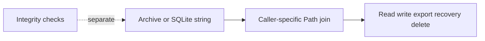
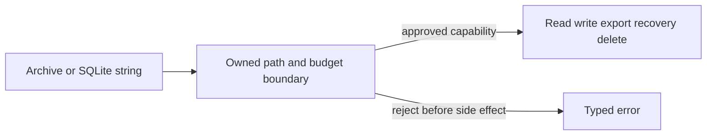
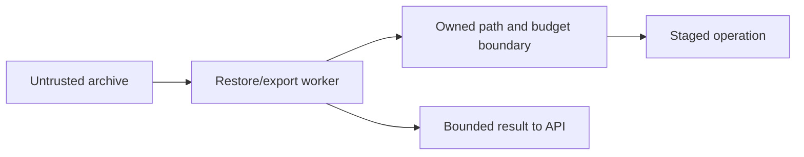

# Security Hardening Proposal: Owned path and resource boundary

## Decision

The repeated structural failure is treating database strings and archive names as already-authorized filesystem capabilities. We should centralize path authorization, archive resource budgets, object identity binding, and destructive cleanup proofs.

## Executive Recommendation

Option 1 is the incremental shared boundary. Option 2 adds a short-lived worker for restore/export fault isolation. We should implement Option 1 first; it is the smallest design that covers all evidence families and preserves the local-first product shape.

## Evidence

| Evidence | Finding | What it establishes |
| --- | --- | --- |
| SEC-B02-01 | Windows archive containment | POSIX-only member validation does not prove Windows destination containment. |
| SEC-B02-02 | Decompression bounds | Full decompression and `read()` occur before resource ceilings. |
| SEC-B02-04 | Backup binding | Internal archive hashes do not prove the audited workspace snapshot was backed up. |
| SEC-B03-01/02 | Dataset manifest/dictionary paths | Persisted SQLite paths are opened without containment and identity rebinding. |
| SEC-B03-04/05 | Export result path/run identity | Persisted paths and IDs select export authorities. |
| SEC-B04-02/03/04 | Result/job/recovery paths | Independent reads and batch recovery lack containment and per-row binding. |
| SEC-B04-05 | Cleanup containment | Equality with `state_root` can satisfy the current recursive-delete predicate. |

I inspected the affected repository and service callers. The evidence is static source review of the scan snapshot; no destructive operation or implementation was executed.

## Current Design And Failure Mode

Each caller constructs a `Path` from a persisted value or archive member. Writers generate relative paths and integrity checks validate bytes, but the later read, export, recovery, or delete does not carry a proof that the final object is inside the expected subtree and belongs to the requested run or dataset. A value can therefore be internally valid yet unauthorized for the operation.

## Desired Invariants

- Persisted references are canonical relative capabilities bound to an expected object and subtree.
- Archive members reject POSIX and Windows rooted/drive/UNC/separator escapes before writes.
- Entry count, compressed bytes, per-member bytes, total expanded bytes, and ratio are bounded before expensive work.
- Cleanup proves candidate != `state_root`, exact approved parent, expected identity, and backup snapshot binding.
- Recovery and export fail closed per object and never let one restored row select another run.

## Constraints And Non-Goals

We preserve local APIs and valid relative project formats. Unsafe legacy rows fail with an actionable migration error unless their target can be proven inside the expected subtree. We do not introduce multi-tenant authorization or a remote service in Option 1.

## Before Architecture

The control is separated from the sink, so internal consistency is mistaken for authorization.

## Options

### Option 1: Shared safe-path and resource-budget APIs

We add one owned resolver for safe relative paths, expected parents, resolved containment, and object identity. Repositories, export, recovery, and cleanup use it instead of joining persisted strings. Archive verification uses bounded streaming and rejects counts, bytes, ratios, and Windows-special names before any write. Cleanup receives a deletion target proven to be an approved reports/runs child and a backup manifest bound to the audited database/files.

The attractive part is recurrence reduction without a deployment component. The cost is migration discipline: direct `state_root / persisted` joins must become forbidden by architecture checks, and unsafe legacy projects need explicit errors. Rollout is reads first, then archive writes, then destructive cleanup. Rollback is a code revert before deletion plus restoration from a verified snapshot.

| Change | Before | After | Security consequence | Cost |
| --- | --- | --- | --- | --- |
| Path construction | Caller joins strings | Shared resolver proves containment/identity | Removes repeated traversal variants | Small validation cost |
| Archive work | Decompress then validate | Bounded streaming before allocation | Limits CPU/RSS abuse | Counters and error paths |
| Cleanup | Name/self-consistency | Exact parent plus backup binding | Prevents root/stale-copy deletion | Migration metadata |

### Option 2: Isolated restore/export worker

A short-lived worker owns archive verification, staging, and export with OS resource limits; the API receives only a bounded manifest/result. This improves failure isolation for unattended inputs, but it still needs Option 1's semantic path and identity policy. IPC, startup, cancellation, crash recovery, observability, and protocol migration add meaningful operational cost. I would choose it if deployment becomes multi-user or measured fault tests show in-process limits are insufficient.

| Change | Before | After | Security consequence | Cost |
| --- | --- | --- | --- | --- |
| Failure boundary | API parses input | Worker owns parsing | Limits process-wide availability loss | Process/IPC complexity |
| Policy | Caller conventions | Shared policy in worker | Semantic checks remain centralized | Protocol migration |
| Recovery | In-process exceptions | Worker crash state | Stronger isolation | More telemetry/tests |

## Comparison

| Dimension | Option 1 | Option 2 |
| --- | --- | --- |
| Security | Addresses all 11 paths; one process remains | Adds process isolation; still needs Option 1 |
| Performance | Small source-derived validation cost; benchmark required | Hypothetical IPC/startup/serialization cost |
| Memory | Bounded counters and streaming | Additional worker and buffers |
| Reliability | Fail-closed typed errors | Stronger crash isolation, more states |
| Operability | One process/metrics | Worker lifecycle and health |
| Migration | Incremental path-column migration | Protocol and feature-flag migration |

## Recommendation

I recommend Option 1 now because it makes the violated invariants explicit at the shared boundary and leaves statistical execution untouched. Option 2 should win if unattended or multi-user archives become a requirement, or if measured fault injection shows process-wide availability remains unacceptable. Neither option is a finding closure until code and the original proof paths are revalidated.

## Evidence Coverage And Residual Risk

| Evidence | Option 1 | Option 2 | Residual risk |
| --- | --- | --- | --- |
| SEC-B02-01/02/04 archive and backup | addresses | mitigates | budgets and backup provenance need measured fixtures |
| SEC-B03-01/02/04/05 persisted/export paths | addresses | mitigates | unsafe legacy rows require migration review |
| SEC-B04-02/03/04/05 analysis/recovery/cleanup | addresses | mitigates | Windows reparse/race behavior needs platform tests |

## Migration And Rollout

Add helpers and negative tests; migrate repository reads; enforce archive bounds and Windows semantics; bind backup manifests to database/file hashes; migrate cleanup; then consider the worker. Keep unsafe operations disabled and record typed migration errors. Roll back before destructive cleanup by restoring the prior snapshot and disabling the capability flag.

## Validation Plan

Re-run every original path, including rooted/UNC/drive archive members; test count, ratio, per-member and total-byte budgets; use legacy fixtures for absolute, dot-dot, symlink/reparse, wrong-run, stale-backup and root-equal paths; verify identity rebinding; run restore/export/recovery/cleanup drills under temporary roots; benchmark CPU, RSS, wall time and cancellation.

## Implementation Work Packages

- `repository_io`: safe-relative value and expected-subtree/object binding.
- `workspace_archive`: Windows-aware validation, bounded streaming, semantic SQLite path checks.
- Repositories/export/recovery: shared resolver and row/object identity rebinding.
- Maintenance/cleanup: backup snapshot binding and exact deletion proof.
- Contracts/tests/docs: migration errors, fixtures, architecture rule, and debt-register evidence.

## Open Questions

What legitimate archive expansion and verification latency should budgets permit? Should provably in-subtree legacy paths auto-migrate or require operator review? Does deployment require the worker boundary?
